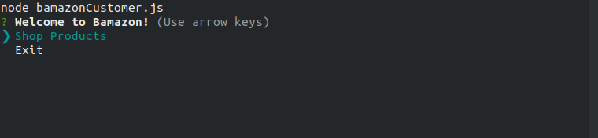
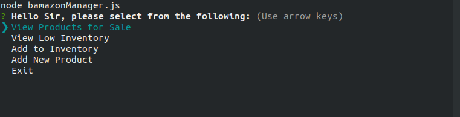
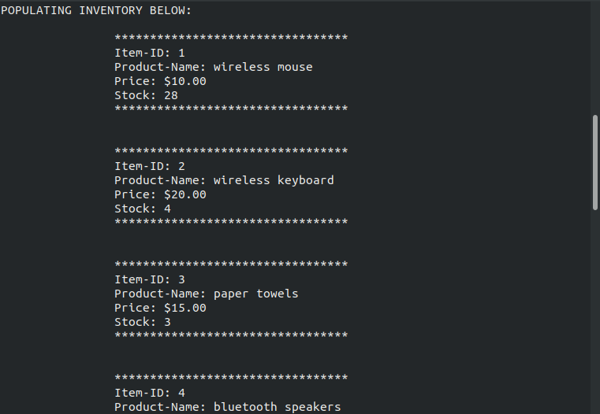
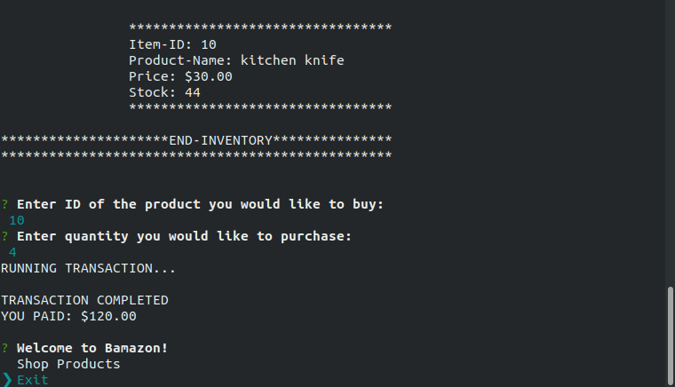
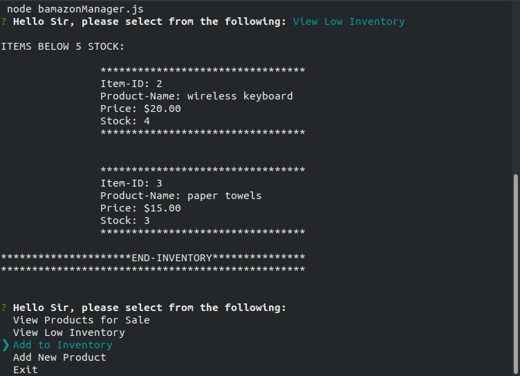
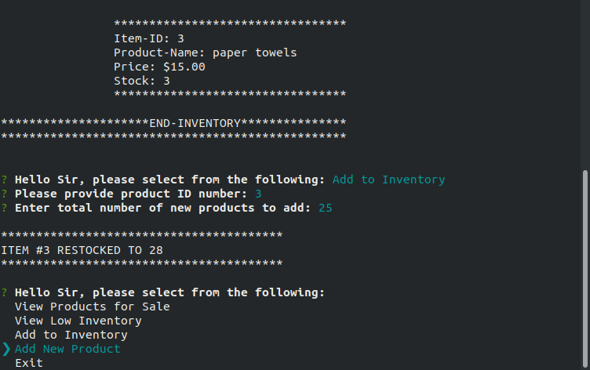
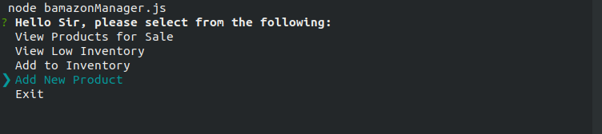
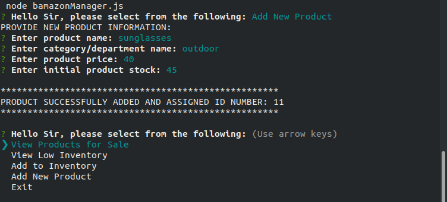
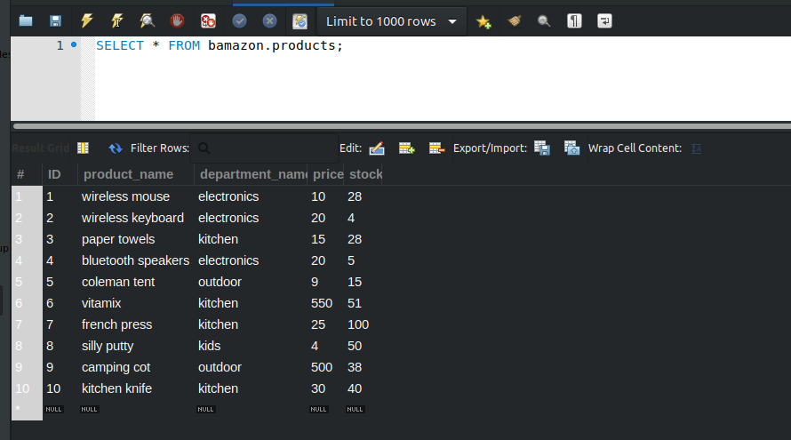
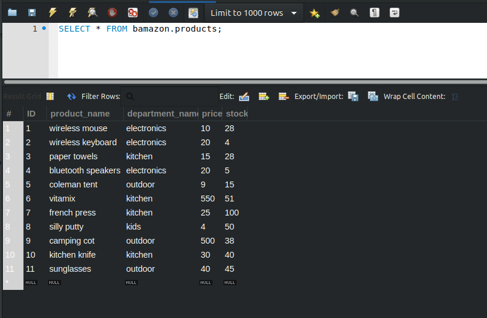

## BAMAZON-STOREFRONT

## ABOUT

* `BAMAZON` is an Amazon-like storefront `node.js` app which utilizes a `MySQL` database running in the cloud with Amazon Web Services. Customers can view the current inventory and place orders for particular items. Of course, orders are fulfilled or rejected depending upon the current supply. Managers can also access the app to replenish depleted stock, view the inventory, or add a new item to the list of available products.

## INSTRUCTIONS

* `CLONE` or `ZIP` + `UNZIP` this repository to your local machine. 

* `RUN` npm install in your CLI for required packages

* `WRITE` a `.env` file using the mysql database username and password

### CUSTOMER ACCESS:

* `RUN` command `node customer` in your terminal/bash window. Follow the on screen prompts to view live inventory or place an order. Viewing the inventory returns :

    * item_id (unique id for each product)

    * product_name (Name of product)

    * department_name

    * stock_quantity (how much of the product is available in stores)

    * price (cost to customer)

### MANAGER ACCESS:

* `RUN` command `node manager`in your terminal/bash window. Running this command will prompt you, as manager, to select from the following commands:

    * View Products for Sale
    
    * View Low Inventory
    
    * Add to Inventory
    
    * Add New Product

  * If a manager selects `View Products for Sale`, the app should lists every item in the inventory: item IDs, names, prices, and quantities.

  * If a manager selects `View Low Inventory`, the app generates a list of all items with an inventory count lower than five.

  * If a manager selects `Add to Inventory`, the app displays a prompt that will let the manager "add more" of any item currently in the store.

  * If a manager selects `Add New Product`, the app allows the manager to add a completely new product to the store.

- - -
## WALKTHROUGH
- - -

#### Customer Access:

#### Manager Access:

#### Inventory before add product:

#### Inventory after add product:

